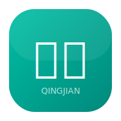

<p align="center">
  
</p>

<h1 align="center">青荐 - 本地生活服务平台</h1>

<p align="center">
  
  
  
  
  
  
</p>

## 项目简介

青荐是一款面向本地生活服务的 C 端平台，涵盖商户检索、优惠券秒杀、社交博客（Feed 流）、用户评价等核心模块。通过 **Redis + RabbitMQ** 实现高并发场景下的性能优化与流量削峰。

> 本项目由黑马点评（HmDianPing）深度重构而来，更名为"青荐"，并新增了评价系统、消息通知、RabbitMQ 异步处理等模块。

## 技术架构

```
前端: Vue.js 2.x + Element UI + Axios
      ↓ HTTP
后端: Spring Boot 2.7 + MyBatis-Plus
      ↓
缓存: Redis (分布式锁 /  Feed流 / 缓存策略)
消息: RabbitMQ (异步下单 / 死信队列 / 消费幂等)
存储: MySQL 8.0
```

## 核心功能模块

| 模块 | 关键技术 | 亮点 |
|------|----------|------|
| **商户推荐** | Haversine 球面距离 + 多维度加权评分 | 支持基于地理位置的智能推荐 |
| **优惠券秒杀** | Redis 预减库存 + Lua 原子脚本 + RabbitMQ 异步下单 + Redisson 分布式锁 | 高并发下保证一人一单、不超卖 |
| **Feed 流** | Redis ZSet 时间线 + 粉丝分批推送 + Pipeline 批量写入 | 大 V 发笔记不 OOM |
| **用户评价** | Redis Set 去重点赞 + Lua 脚本防并发重复 | 点赞幂等、标签统计 |
| **消息通知** | RabbitMQ 死信队列 + 消费幂等 | 异常消息不丢失、不重复消费 |
| **缓存架构** | 缓存穿透（布隆过滤器/空值）+ 缓存击穿（互斥锁/逻辑过期）+ 缓存雪崩（TTL 随机）| 多级缓存保障 |

## 项目亮点（面试重点）

### 1. 秒杀系统
- **Redis 预减库存**：通过 Lua 脚本保证库存扣减的原子性
- **Redisson 分布式锁**：保证一人一单，防止重复抢购
- **RabbitMQ 异步下单**：秒杀成功后发送 MQ 消息异步创建订单，实现流量削峰
- **死信队列**：消费失败的消息转入死信队列，避免无限重试死循环
- **消费幂等**：基于 Redis `setIfAbsent` 保证订单不重复创建

### 2. Feed 流推送
- **Redis ZSet**：以时间戳为 score 构建用户时间线
- **分批 + Pipeline**：大 V 粉丝过多时，分批查询粉丝列表，Pipeline 批量写入 Redis，防止内存溢出

### 3. 缓存策略
- **缓存穿透**：布隆过滤器 + 空值缓存
- **缓存击穿**：互斥锁 + 逻辑过期
- **缓存雪崩**：热点 key 设置随机 TTL

### 4. 商户推荐
- **Haversine 公式**：基于球面距离计算用户与商户的直线距离，避免平面距离在高纬度地区的误差
- **加权评分算法**：综合距离、评分、销量多维度计算推荐分

## 快速开始

### 环境要求
- JDK 1.8+
- MySQL 8.0
- Redis 6.2+
- RabbitMQ 3.11+
- Maven 3.6+

### 1. 克隆项目

```bash
git clone https://github.com/jiyou9656-ai/qingjian.git
cd qingjian
```

### 2. 初始化数据库

```bash
# 创建数据库并执行初始化脚本
mysql -u root -p < src/main/resources/db/hmdp.sql
mysql -u root -p < shop_comment.sql
```

### 3. 配置 Redis 和 RabbitMQ

修改 `src/main/resources/application.yaml`：

```yaml
spring:
  redis:
    host: localhost
    port: 6379
    password: 
  rabbitmq:
    host: localhost
    port: 5672
    username: admin
    password: admin
```

### 4. 启动 RabbitMQ（Docker）

```bash
docker run -d --name rabbitmq -p 5672:5672 -p 15672:15672 \
  -e RABBITMQ_DEFAULT_USER=admin \
  -e RABBITMQ_DEFAULT_PASS=admin \
  rabbitmq:3-management
```

### 5. 启动后端

```bash
mvn spring-boot:run
```

或运行 `QingJianApplication.java` 主类。

### 6. 启动前端

前端为纯静态页面，可直接用 Nginx 或 Live Server 启动：

```bash
cd qingjian-front
# 使用 Python 临时服务
python -m http.server 8080
# 或使用 Nginx
nginx
```

访问 http://localhost:8080 即可。

## 项目结构

```
qingjian/
├── src/main/java/com/qingjian/
│   ├── config/          # 配置类（Redis、RabbitMQ、拦截器）
│   ├── controller/      # 控制层
│   ├── service/         # 业务层
│   ├── entity/          # 实体类
│   ├── mapper/          # 数据访问层
│   ├── mq/              # MQ 消费者
│   └── utils/           # 工具类
├── src/main/resources/
│   ├── db/hmdp.sql      # 数据库初始化脚本
│   └── application.yaml # 配置文件
├── qingjian-front/      # Web 前端项目
│   ├── index.html       # 首页
│   ├── shop-list.html   # 商户列表
│   ├── shop-detail.html # 商户详情
│   └── ...
├── miniapp/             # 微信小程序（Taro 框架）
│   ├── src/pages/       # 页面（首页、发现、发布、消息、我的）
│   ├── src/components/  # 通用组件（商户卡片、笔记卡片）
│   └── src/services/    # API 服务封装
└── shop_comment.sql     # 评价系统数据脚本
```

## 技术栈

**后端：**
- Spring Boot 2.7
- MyBatis-Plus
- Redis（Jedis/Lettuce）
- RabbitMQ
- Redisson
- Lombok

**前端：**
- Vue.js 2.x（Web 端）
- Element UI
- Axios
- Taro 3.x（微信小程序，跨端开发）

**中间件：**
- Redis 6.2
- RabbitMQ 3.11
- MySQL 8.0

## 开源协议

MIT License
